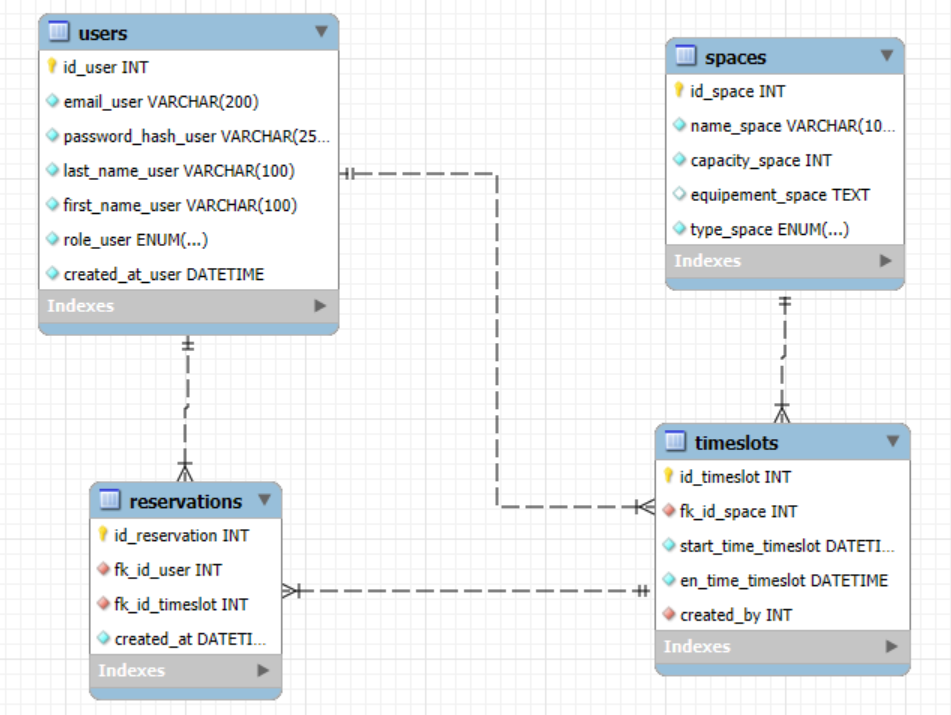

# Gestion de Réservations d’Espaces de Coworking

## Description du projet

Une entreprise de coworking souhaite disposer d’un outil interne pour permettre aux membres de réserver des espaces de travail ou des salles de réunion. Le système permettra aux utilisateurs de créer un compte, réserver des créneaux horaires, et aux gestionnaires de suivre l’occupation des espaces.

Trois rôles sont distingués :

- **Membre** : peut réserver un espace ou une salle
- **Gestionnaire** : peut créer ou supprimer des créneaux, visualiser toutes les réservations
- **Administrateur** : gère les comptes utilisateurs et attribue les rôles

## Instructions d'installation

Le projet doit être utilisé en localhost (WAMP etc..). La base de données et les tables doivent être créées avec les commandes SQL fournies directement dans phpmyadmin. 

## Tables de la base de données

Tables mises en place à l'aide MySQL Workbench 

## User Stories Couvertes

### User stories obligatoires

- En tant que nouveau membre, je souhaite pouvoir créer un compte avec mes informations personnelles, afin de pouvoir effectuer des réservations.

- En tant que membre, je souhaite me connecter avec mon email et mot de passe, afin de gérer mes réservations.

- En tant que membre, je souhaite consulter la liste des espaces de travail et salles de réunion disponibles, avec leur capacité et équipements.

- En tant que membre, je souhaite réserver un espace ou une salle à un créneau donné, afin d’y travailler.

- En tant que membre, je souhaite annuler une de mes réservations futures, si je ne peux pas m’y rendre.

### User stories recommandées

- En tant que gestionnaire, je souhaite pouvoir créer un créneau horaire disponible pour un espace, afin qu’il soit réservable.

- En tant que gestionnaire, je souhaite voir toutes les réservations d’un espace donné sur une période, afin de gérer l’occupation.

### User stories bonus

- En tant que gestionnaire, je souhaite supprimer un créneau futur (non réservé), afin de le rendre indisponible.

- En tant qu’administrateur, je souhaite pouvoir changer le rôle d’un utilisateur, afin de lui accorder plus de droits.